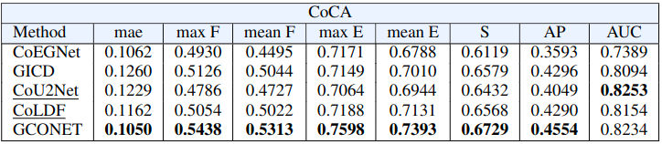
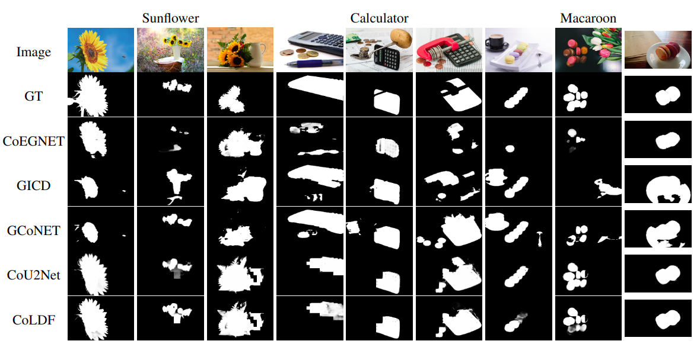

<br />
<p align="center">
  <h1 align="center">Sal.Co </h3>  

  <h3 align="center">PyTorch-Based Co-Saliency testing framework</h3>

  <p align="center">
    Automatically evaluate your saliency algorithm in co-saliency detection task.
    Extend your saliency algorithm with co-localization funcionalities.
  </p>
</p>

## Description

In this paper, we propose a framework for the detection of object co-saliency, which is a modification of the CoEGNet method. The proposed approach works on an achieved saliency mask from a saliency detector and tries to indicate saliency objects which coexist in a group of images. As part of our framework, two novel methods for co-salient object detection have been proposed (CoU2Net and CoLDF). Both methods in one branch use algorithms for image saliency object detection, meanwhile second branch is responsible for repetitive object detection, based on feature vector extractor (VGG-19), and the DDT method is improved by using Conditional Random Fields. The proposed architectures are tested based on U2NET and label decoupling framework (LDF) called in this paper CoU2Net and CoLDF, respectively. Two saliency detectors used in our proposed methods are one of the best solutions in this field. The proposed solutions were tested on three datasets: CoCA, CoSal2015, and CoSOD3k, and compared with some of the best algorithms in co-silent object detection: GICD and CoEGNet. The advantages and disadvantages of the proposed method are highlighted and discussed.

## Usage
### Requirements
- Python >= 3.5,
- Numpy,
- Pandas,
- OpenCV,
- PyTorch,
- DenseCRF.

### Datasets
Dataset has to have data separated into classes (categories).

Example testing datasets: 
- CoSAL2015,
- CoSOD3k
- CoCA.

Usually saliency algorithms doesn't produce results separated into classes. We provide utility scripts to flatten directory structure and bring it back to original form. Those scripts are located in `src/utils` directory.

### How to run?
```
    python3 src/main.py \
        --train_dir {PATH_TO_YOUR_DATA_DIR}/CoCA/image \
        --sal_dir {PATH_TO_YOUR_DATA_DIR}/LDF_group/CoCA \
        --save_dir {GIT_ROOT}/cosal_sal_testing/data/results/CoCA
```

You could use GPU if you have one.
```
    CUDA_VISIBLE_DEVICES=0 python3 src/main.py \
        --train_dir {PATH_TO_YOUR_DATA_DIR}/CoCA/image \
        --sal_dir {PATH_TO_YOUR_DATA_DIR}/LDF_group/CoCA \
        --save_dir {GIT_ROOT}/cosal_sal_testing/data/results/CoCA
```

## Results

We used our framework to evaluate two state-of-the-art saliency methods in co-saliency detection task. Specifically, we used [LDF](https://github.com/weijun88/LDF) and [U<sup>2</sup>-Net](https://github.com/xuebinqin/U-2-Net).

We used the [Eval Co-SOD](https://github.com/zzhanghub/eval-co-sod) tool for evaluation.

Results from CoCA evaluation dataset.






Comparison of predicted co-saliency maps for five methods.


<!-- ### Contact -->


